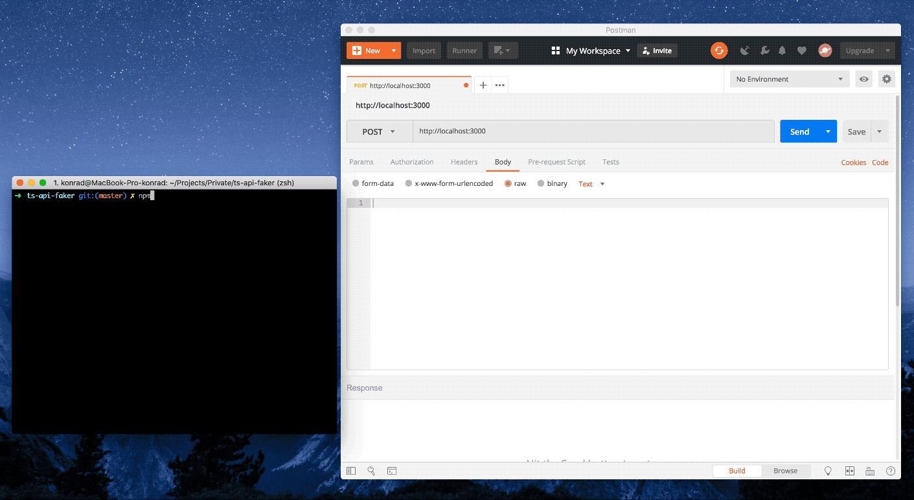

## What is it?

Minimal fake API server based on faker.js and unsplash.com

## Why should you use it?

To fake backend before its made and start frontend development just after project planning.

## How it works?



## How to use it?

After making post request with json argument

```json
[
  {
    "name": "name.firstName",
    "surname": "name.lastName",
    "mail": "internet.email",
    "profilePhoto": "internet.avatar",
    "animalPhoto": "image.cat"
  },
  {
    "name": "name.firstName",
    "surname": "name.lastName",
    "mail": "internet.email",
    "profilePhoto": "internet.avatar",
    "animalPhoto": "image.dog"
  }
]
```

it returns

```json
[
  {
    "name": "Van",
    "surname": "Veum",
    "mail": "Corbin.Fritsch49@gmail.com",
    "profilePhoto": "https://s3.amazonaws.com/uifaces/faces/twitter/pixage/128.jpg",
    "animalPhoto": "https://source.unsplash.com/200x200/?cat"
  },
  {
    "name": "Serena",
    "surname": "Wilderman",
    "mail": "Mariam_Thiel@hotmail.com",
    "profilePhoto": "https://s3.amazonaws.com/uifaces/faces/twitter/imcoding/128.jpg",
    "animalPhoto": "https://source.unsplash.com/200x200/?dog"
  }
]
```

Ant these 2 photos looks like


## Installation

Clone this repo and run

```
npm install
npm run build
```

## Run development server

```
npm run dev
```

## Run production server

```
npm run start
```

or using docker image

```
docker run -d -p 3000:3000 slothking/ts-api-faker
```

## Build

```
npm run build
```


## Contribute

Feel free to contact us and contribute. aexol@aexol.com

1.  fork this repo
2.  Create your feature branch: git checkout -b feature-name
3.  Commit your changes: git commit -am 'Add some feature'
4.  Push to the branch: git push origin my-new-feature
5.  Submit a pull request

